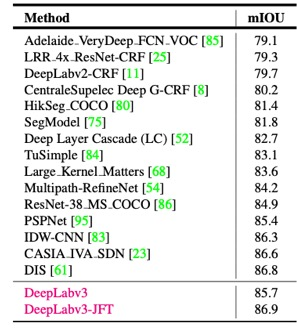
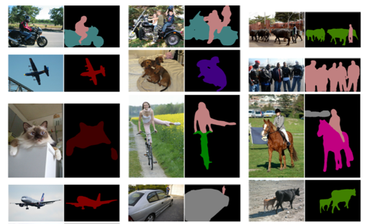

## 601-mini-project2
# Machine learning 

### Introduction

Machine learning is a way to realize the artificial intelligence, which also are divided into several categories, such as, supervised learning, unsupervised learning, Semi-supervised learning and Reinforcement learning. Deep learning is the most active area of research in recent years, and it has been successfully applied in a lot of domains, such as speech recognition, natural language processing and computer vision [1]. Basically, it stems from artificial neural network, which is a kind of machine learning technique, but has more advanced and biomimetic merits than traditional machine learning methods.

For tradition machine learning skills, some features designed by experts must be inputted to a model, and then these features will be trained to produce the weights of the model, which will be utilized during the process of classification. These methods were successfully implemented in the last ten years, but they sometimes show the inability in some applications with an extremely large scale of samples or high dimension samples. Therefore, deep learning-based method was introduced to conquer these problems. The most dramatic improvement of deep learning is that, it can learn the features of the target without any human experience and has multiple layers to learn uniqueness of the sample in depth [1] [2].

Deep Convolutional network (CNN) has been the most significant structure in recognition task, since the first notable architecture ‘AlexNet’ [5] proposed in 2012. The top four popular applications of CNN in computer vision are classification, detection, location and semantic segmentation [3]. To increase the capacity of the deep network, some effective CNN structures, including VGGNet [6], ResNet [7], Inception-Net [8], etc., have been invented and obtain remarkable results in both academics and industry. Furthermore, these popular models provide useful references to the researchers, so that they can carry out their own design idea in an effective way.

Image semantic segmentation is increasingly being of interest in computer vision domain. Applications including robot vision, autonomous driving, indoor navigation and medical purposes, need accurate and effective segmentation mechanism so that they can be implemented in practice. Although there were many proposed methods for image segmentation, most of them cannot distinguish different objects or fail to output the detail boundary of the object. The modified CNN structure called Fully connected networks (FCN) [4] achieved a great breakthrough in segmentation and introduced CNN into FCN in the first place. After that, lots of methods based on this idea were proposed to increase the accuracy and efficiency of the segmentation system.

### Analysis
In this report, Deeplab architecture would be introduced detailly. For the traditional segment problem, there are three challenge: Firstly, Continuous pooling and downsampling in traditional classification CNN leads to a decrease in spatial resolution. Secondly, Object-to-scale detection problems use re-adjusting scales and aggregating feature maps, but with a large amount of computation. Thirdly, Object-centric classification needs to ensure spatial transformation invariance. For DeeplabV1&V2, they use atrous convolution, which can adjust filters’ field-of-views and determined the feature resolution of the DNN. However, DeeplabV3 combines the advantages of encoder-decoder and Pyramid, which is good in capturing multi-scale context. Besides, DeeplabV3 employs astrous convolution with upsampled filters to extract dense feature maps and to capture long range content. Specifically, to encode multi-scale information, our proposed cascaded module gradually doubles the atrous rates while our proposed atrous spatial pyramid pooling module augmented with image-level features probes the features with filters at multiple sampling rates and effective field-of-views. The following table show the comparison between DeepLABv3 and other frameworks on the ASCAL VOC 2012 test set. And the Figure 1 shows the Visualization results of the DeeplabV3. In the experiment, there are numerous factors that might have influence of test results. For instance, employing small batch size is inefficient to train the model, while using larger batch size leads to better performance.

Table 1. Performance on PASCAL VOC 2012 test set

Figure 1. Visualization results of the DeeplabV3

### Conclusion

### Reference

[1] LeCun, Yann, et al. “Deep Learning.” Nature, vol. 521, no. 7553, 2015, pp. 436–444.

[2] Chen, Yoking, and Yang Xu. "A deep learning approach to human activity recognition based on single accelerometer." Systems, Man, and Cybernetics (SMC), 2015 IEEE International Conference on IEEE, 2015.

[3] Zhang R, Tang S, Zhang Y, et al. Scale-Adaptive Convolutions for Scene Parsing[C]//Proceedings of the IEEE Conference on Computer Vision and Pattern Recognition. 2017: 2031-2039.

[4] Long J, Shetlander E, Darrell T. Fully convolutional networks for semantic
segmentation[C]//Proceedings of the IEEE Conference on Computer Vision and Pattern
Recognition. 2015: 3431-3440.

[5] Krizhevsky, Alex, Ilya Sutskever, and Geoffrey E. Hinton. "ImageNet Classification with Deep Convolutional Neural Networks." neural information processing systems (2012): 1097-1105.

[6] Simonyan, Karen, and Andrew Zisserman. "Very Deep Convolutional Networks for Large-Scale Image Recognition." international conference on learning representations (2015).

[7] He, kaiming, et al. “Deep Residual Learning for Image Recognition.” computer vision and pattern recognition (2016): 770-778.

[8] Szegedy, Christian, et al. “Rethinking the Inception Architecture for Computer Vision.” 2016 IEEE Conference on Computer Vision and Pattern Recognition (CVPR), 2016, pp. 2818–2826.
